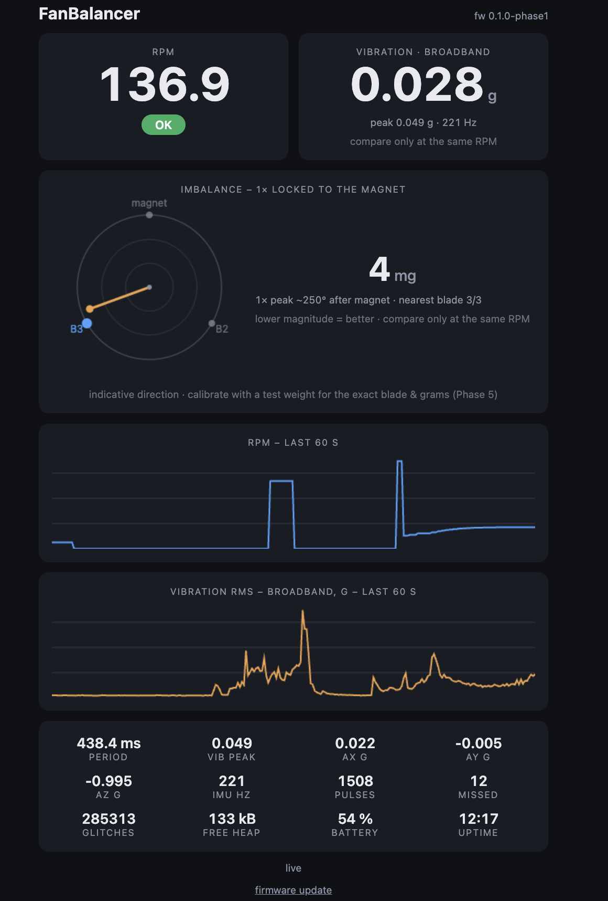
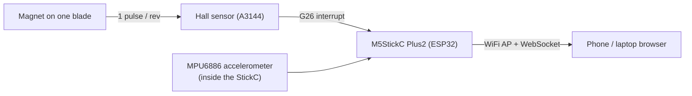

# FanBalancer

**A pocket-sized fan balancing tool built on the M5StickC Plus2.**
It measures rotation speed with a Hall sensor and vibration with the onboard
accelerometer, then tells you **which blade to weight and by how much** —
using the standard single-plane influence-coefficient method. No PC needed on
the ladder: the device hosts its own WiFi and web app.




---

## What it does

- 📈 **RPM & rotation** from a Hall sensor + one magnet — median-filtered, with
  glitch and missed-pulse detection.
- 📳 **Vibration** from the built-in MPU6886 — broadband RMS / peak, gravity
  removed.
- 🎯 **Imbalance vector** — a 1×-rotation synchronous lock-in (referenced to the
  magnet) that pulls the real imbalance out of the noise and shows its
  **direction on a polar dial**.
- 🧭 **Balancing wizard** — baseline → known test weight → **exact correction**
  (which blade, how many grams) via influence coefficients.
- 🌐 **Self-hosted web UI** over its own WiFi access point (works with no
  router), live over WebSocket. Includes **OTA firmware update** — flash new
  builds from the browser, no cable.
- 🔋 Runs on the StickC's internal battery. Fits in a pocket.

---

## Bill of materials

Everything needed to build one, roughly **US $25–30** total:

| # | Component | Qty | Notes | ~Price |
|--:|-----------|:---:|-------|:------:|
| 1 | **M5StickC Plus2** | 1 | ESP32-PICO, 1.14" LCD, **MPU6886 IMU built in**, 200 mAh battery, USB-C. The whole brain + sensor + screen + battery in one. | $22 |
| 2 | **Hall switch module** (A3144 + LM393) | 1 | The common 4-pin breakout: `VCC / GND / DO / AO`, with a **trimmer potentiometer** and signal LED. The trimmer matters — see assembly. | $1–2 |
| 3 | **Neodymium magnet** | 1 | Small disc/cylinder, e.g. 5×2 mm or 6×3 mm. One per fan. | $0.50 |
| 4 | **Jumper wires** (female–female) or a Grove cable | 3 | Hall module → StickC 8-pin header. | $1 |
| 5 | **Mounting** | – | Double-sided foam tape and/or a zip tie to fix the StickC and the Hall sensor to the motor housing; a dab of super glue for the magnet. | $1 |
| 6 | **USB-C cable** | 1 | First flash only (afterwards updates go over WiFi). | – |

**Optional / situational**

| Component | When you need it |
|-----------|------------------|
| 10 kΩ + 20 kΩ resistors | Only if you power the Hall module from **5 V** — the ESP32 is **not 5 V tolerant**, so `DO` needs a divider. Powering from 3.3 V (recommended) needs none. |
| Small 3D-printed bracket | For a tidy, repeatable mount instead of tape. |

> **Why the M5StickC Plus2?** It bundles the exact accelerometer the project
> needs (MPU6886), a screen, a battery and WiFi in a ~48 g stick — light enough
> to clamp onto a fan without adding meaningful mass, and it exposes GPIO26 on
> its header for the Hall interrupt.

---

## Wiring

Connect the Hall module to the StickC Plus2 **8-pin header**:

```
Hall module            M5StickC Plus2 header
-----------            ---------------------
VCC  ────────────────  3V3          ← try 3.3 V first (see note)
GND  ────────────────  GND
DO   ────────────────  G26          ← hardware interrupt input
AO   ────────────────  (not connected)
```



**Power note.** The A3144 is rated 4.5–24 V, but with a strong neodymium magnet
at a 5–10 mm gap the common breakout modules work fine from **3.3 V** — no extra
parts, works on battery. If detection is unreliable, power `VCC` from **5V** and
add the divider on `DO` (ESP32 is not 5 V tolerant):

```
DO ──[ 10 kΩ ]──┬── G26
                └──[ 20 kΩ ]── GND      (5 V → 3.3 V)
```

---

## Assembly

1. **Wire** the Hall module to the header as above.
2. **Glue the magnet** to one fan blade (or the rotating hub), near the tip. The
   A3144 switches on **one magnetic pole only** — if you get no pulses, flip the
   magnet over.
3. **Mount the Hall sensor** on the *stationary* part (motor housing) so the
   magnet sweeps past it at a **5–10 mm gap** once per revolution.
4. **Mount the StickC** firmly on the motor housing (foam tape or a bracket). It
   must be **rigidly attached** — it can only feel vibration that actually
   reaches it. Don't let it dangle.
5. **Power on**, spin the blade **by hand**, and watch the StickC's **red LED**:
   it should flash **exactly once per pass**.
   - Flashing **twice** per pass? The comparator is double-triggering — **turn
     the module's trimmer potentiometer** until it clicks once. (Moving the
     magnet closer or using a stronger one also helps.)
   - No flash at all? Flip the magnet, or reduce the gap.

That single-flash-per-pass check is the whole calibration for the RPM side.

---

## Build & flash

Requires [PlatformIO](https://platformio.org/) (CLI or the VS Code extension) —
no Arduino IDE.

```sh
git clone <your-repo-url> && cd FanBalancer
pio run                 # build
pio run -t upload       # flash over USB-C (first time only)
pio device monitor      # optional serial log @115200
```

After the first USB flash, every later update can go **over WiFi**: open the web
UI, tap **firmware update**, and upload `.pio/build/m5stick-c-plus2/firmware.bin`.

> The stock espressif32 platform has no dedicated Plus2 board id, so
> `platformio.ini` uses the `m5stick-c` definition with the Plus2's 8 MB flash /
> partitions overridden. M5Unified detects the exact board at runtime.

---

## Using it

1. Power on. The screen shows the WiFi name and the address.
2. On your phone/laptop, join WiFi **`FanBalancer`** (password `balance123`,
   change it in [`src/config.h`](src/config.h)).
3. The page usually opens itself (captive portal). Otherwise go to
   **http://192.168.4.1** or **http://fanbalancer.local**.

You'll see live **RPM**, **vibration**, the **imbalance dial**, and 60-second
history charts (see the screenshot above).

### Balancing a fan (the wizard)

The **Balancing wizard** card walks the single-plane influence-coefficient
method:

1. Spin the fan to a steady speed → **Start** (captures the baseline).
2. **Stop the fan**, tape a known **test weight** (e.g. 1 g) near a blade tip,
   spin back up to the **same speed**.
3. Enter the grams and blade → **Measure with weight**.
4. Read the recommendation: heavy-spot angle, and the correction as grams on
   one or two blades. The **green mark on the dial** shows where to add.
5. **Remove the test weight**, add the correction, and run again to verify.

Because the test-weight step calibrates the unknown sensor mounting angle and
structural lag, the "which blade" answer here is real — not just indicative.

---

## How it works

- The **Hall pulse is the 0° angle reference** (Phase 3): every accelerometer
  sample is tagged with an interpolated rotor angle.
- A **synchronous lock-in** (Phase 4) projects the gravity-removed vibration
  onto `cos`/`sin` of that angle and averages over ~1 s. Uncorrelated noise
  averages to zero, leaving just the 1×-rotation component — a stable vector
  (magnitude + phase). This is why the dial is calm while the raw broadband
  trace jitters, and it's robust to non-uniform sampling because each sample
  carries its own exact angle.
- The **wizard** (Phase 5) turns that vector into a correction: with baseline
  `V0` and trial `V1` for a known weight `T`, the influence coefficient
  `α = (V1−V0)/T` gives the true imbalance `U0 = V0·T/(V1−V0)`; the correction
  is `−U0`, split across the two straddling blades.

Everything is non-blocking (no `delay()`); the IMU samples at ~230 Hz in the
main loop, and the async web server streams telemetry at 4 Hz.

## Project structure

```
src/
├── main.cpp          module wiring + non-blocking main loop
├── config.h          pins, tunables, texts
├── hall.cpp/.h       RPM, glitch/missed-pulse filtering, angle interpolation
├── imu.cpp/.h        MPU6886 sampling + broadband vibration
├── analysis.cpp/.h   1× synchronous lock-in (imbalance vector)
├── balancer.cpp/.h   influence-coefficient balancing wizard
├── display.cpp/.h    on-device status / diagnostics screens
├── webserver.cpp/.h  WiFi AP, HTTP + WebSocket + OTA + /api
└── web_content.h     embedded single-page web UI (no CDN, fully offline)
```

## Status & roadmap

| Phase | Content | State |
|------:|---------|:-----:|
| 1 | Hall RPM + web UI + status display | ✅ |
| 2 | MPU6886 broadband vibration | ✅ |
| 3 | Per-sample rotor-angle sync (magnet = 0°) | ✅ |
| 4 | 1× synchronous lock-in → imbalance vector | ✅ |
| 5 | Balancing wizard (influence coefficient) | ✅ |
| — | OTA update over WiFi | ✅ |
| — | Persist settings/calibration to NVS | ⬜ |
| — | True uniform 500 Hz sampling via MPU6886 FIFO | ⬜ |
| — | CSV logging / export | ⬜ |

Also works, with a suitable magnet + mount, for desk fans, propellers, blower
wheels and grinding wheels.

## Notes / deviations from the original spec

The project was specified for the M5Stack Core2 but targets the **M5StickC
Plus2** instead — lighter (less mass loading on the fan), has the exact MPU6886
the spec names, and exposes GPIO26 on its header. The touchscreen UI from the
spec became a **browser app** served by the device.

## License

Released under the **MIT License** — see [`LICENSE`](LICENSE).
